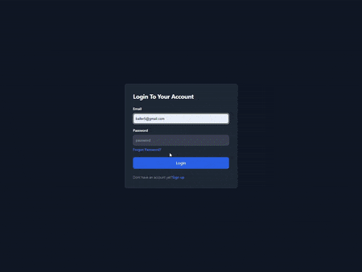
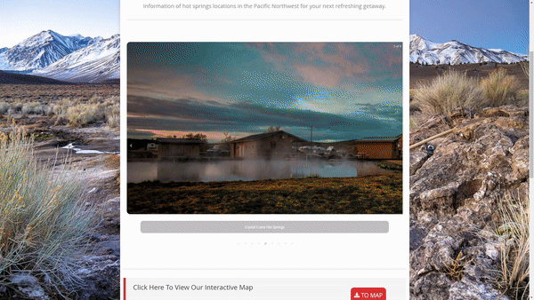

<h1 align="center">Welcome to the GitHub of Jordan Moldovan</h1>

<h3 align="center">Connect with me:</h3>

  

  
  

<!-- 🔭 Check back soon for my finished project utilizing JS, HTML/CSS, and Leaflet. -->

👨‍💻 Learn  more about me and services I can provide at [https://jordan-moldovan.com/](https://jordan-moldovan.com/)

📫 Reach me at **jmoldyvan@gmail.com**

💬 Thank you for visiting, take a look at some of the projects I have recently completed!

<h2 align="center"><u>Projects</u></h2>

<table bordercolor="#66b2b2">
  
  <tr>
    <td width="50%" valign="top">
      <h3 align="center"<a href="https://who-dat-pokemon.netlify.app/">Who's That Pokemon! Tile Game</a></h3>
       
        
       
        
<strong><a href="https://whomthatpokemon.netlify.app/">Who's That Pokemon Game!</a></strong> - Fullstack launched app with Firebase authentication, Sass, MERN, and some React MUI. This app tracks your score, has a leaderboard, secure login through Firebase, and great animations.

    </td>    
    <td width="50%" valign="top">
<h3 align="center"> West Coast Hot Springs</h3>
         
      
         
        
<strong><a href="https://westcoasthotsprings.vercel.app/">React, Node, Express </a></strong> - Full stack Web Application. Made with React, Node, and Express. User Authentication, user profiles, a unique self-made database, interactive leaflet map.

    </td>
  </tr>
  

</table>

<h2 align="center"><u>My Github Stats</u></h2>

<!-- 
&nbsp;
 -->

