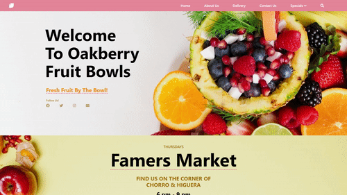
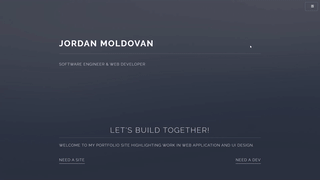
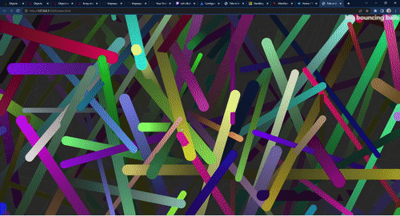

<h1 align="center">Welcome to the GitHub of Jordan Moldovan</h1>

<h3 align="center">Connect with me:</h3>

  

  
  
  <a href="https://twitter.com/JordanMoldovan" target="_blank">
    
  

<!-- 🔭 Check back soon for my finished project utilizing JS, HTML/CSS, and Leaflet. -->

👯 I’m looking to collaborate on **Open Source projects of all sizes like https://github.com/4paradigm/OpenMLDB**

👨‍💻 Learn  more about me and services I can provide at [https://jordan-moldovan.netlify.app/](https://jordan-moldovan.netlify.app/)

📫 Reach me at **jmoldyvan@gmail.com**

💬 Thank you for visiting, take a look at some of the projects I have recently completed!

<h2 align="center"><u>Projects</u></h2>

<table bordercolor="#66b2b2">
  
  <tr>
    <td width="50%" valign="top">
      <h3 align="center">oakberry-fruit-bowls.netlify.app</h3>
         
        
         
        
<strong><a href="https://oakberry-fruit-bowls.netlify.app">All Original HTML/CSS and JavaScript </a></strong> - A complete landing site template designed for a niche family owned restaurant.

    </td>
    <td width="50%" valign="top">
      <h3 align="center">jordan-moldovan.netlify.app</h3>
         
      
         
        
<strong><a href="https://jordan-moldovan.netlify.app">Using BootStrap, JavaScript, HTML/CSS </a></strong> - My Portfolio Site, built with excellence and flair. Check it out to learn more about me!

    </td>
  </tr>
  
  <tr>
    <td width="50%" valign="top">
      <h3 align="center"<a href="https://interactive-data-eruption-map.netlify.app/">Significant Volcanic Eruption Interactive</a></h3>
       
        
       
        
<strong><a href="https://interactive-data-eruption-map.netlify.app/">Utilizing NOAA Database and the Leaflet JS Library</a></strong> - This application was designed in order to visualize a large database onto a global map. As well as provide some visual representation for the scale of these historical eruptions.

    </td>
    <td width="50%" valign="top">
      <h3 align="center">An Early 90's Themed Screensaver!</h3>
         
        
         
        
<strong>No CSS, Only Javascript!</strong> - Based off of those early windows screensavers! Get your nostalgia satisfied

    </td>
  </tr>
</table>

<h2 align="center"><u>My Github Stats</u></h2>

  

<!-- 
&nbsp;
 -->

<h3 align="center">Languages and Tools:</h3>

         

